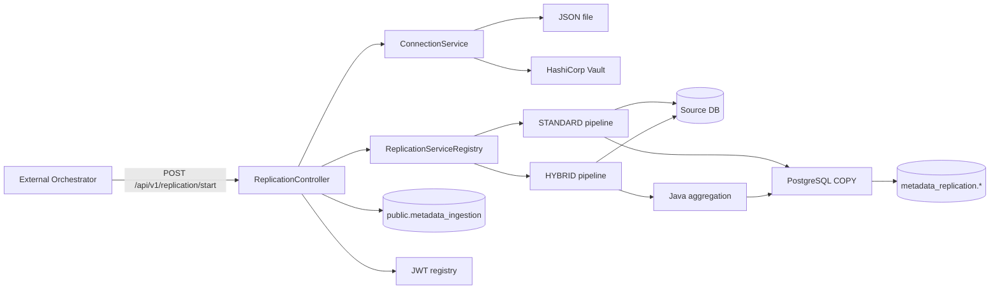

# Metadata Replication Service

Сервис репликации технических метаданных из внешних СУБД в локальный PostgreSQL snapshot.

Поддерживаемые источники:

- PostgreSQL / Greenplum-compatible PostgreSQL catalogs;
- Oracle;
- Microsoft SQL Server;
- SAP IQ.

Для каждого источника поддерживаются два pipeline:

- `STANDARD` — прямое чтение metadata SQL и streaming в PostgreSQL через `COPY`;
- `HYBRID` — плоское bulk-чтение системных каталогов, параллельная агрегация metadata в Java и атомарная публикация готового snapshot через PostgreSQL `COPY`.

Для больших источников рекомендуется `HYBRID`.

---

## 1. Назначение

Сервис формирует локальный snapshot следующих уровней metadata:

1. `DATABASE`;
2. `SCHEMA`;
3. `TABLE` / `VIEW` / `MATERIALIZED_VIEW`.

Для table-level metadata сохраняются:

- тип объекта;
- описание;
- определение представления;
- колонки;
- типы колонок;
- ordinal position;
- nullable / `NOT_NULL`;
- constraints;
- vendor-specific поля, если они нужны для сохранения исходной семантики.

Результат используется как локальный слой metadata для последующей обработки и загрузки в downstream-системы, включая OpenMetadata.

Сервис не содержит бизнес-расписания запуска репликаций. Для production-оркестрации предполагается внешний orchestrator, вызывающий REST API сервиса.

---

## 2. Общая архитектура



Основные компоненты:

| Компонент | Назначение |
|---|---|
| `ReplicationController` | REST API запуска репликации |
| `ReplicationServiceRegistry` | Выбор реализации по `(DatabaseType, ReplicationPipeline)` |
| `ReplicationService` | Общая orchestration/transaction логика |
| `SourceJdbcConnectionFactory` | Подключение к источнику и failover по JDBC URL |
| `*ReplicationImpl` | STANDARD pipeline конкретной СУБД |
| `*HybridReplicationImpl` | HYBRID pipeline конкретной СУБД |
| `*MetadataCopyStreamer` | Streaming ResultSet → PostgreSQL COPY |
| `*HybridMetadataCopyStreamer` | Flat metadata extraction, Java aggregation и COPY |
| `MetadataRepository` | DELETE / cleanup target snapshot |
| `IngestionMetricService` | Статусы и счётчики выполнения |
| `SqlQueryProvider` | Загрузка SQL из `classpath:sql/<db>/<name>.sql` |
| `ConnectionService` | Получение source connection из Vault или JSON-файла |

---

## 3. Поддерживаемые СУБД и pipeline

| Database type | STANDARD | HYBRID | Multi-database |
|---|---:|---:|---:|
| `POSTGRES` | ✅ | ✅ | ✅ |
| `ORACLE` | ✅ | ✅ | один DB на connection |
| `MSSQL` | ✅ | ✅ | ✅ |
| `SAPIQ` | ✅ | ✅ | один DB на connection |

Pipeline выбирается:

1. явно в REST-запросе;
2. если параметр не передан — из `application.yaml`.

```yaml
replication:
  oracle:
    pipeline: HYBRID
  postgres:
    pipeline: HYBRID
  mssql:
    pipeline: HYBRID
  sapiq:
    pipeline: HYBRID
```

Допустимые значения:

```text
STANDARD
HYBRID
```

---

## 4. STANDARD pipeline

STANDARD выполняет vendor-specific SQL и передаёт строки в target PostgreSQL через streaming `COPY`.

Упрощённо:

```text
Source JDBC ResultSet
        ↓
row serializer
        ↓
PostgreSQL COPY
        ↓
metadata_replication.*
```

Преимущества:

- простой execution path;
- удобно использовать как fallback;
- полезен для сравнения результата HYBRID;
- минимальное количество Java-side aggregation logic.

Ограничения:

- сложный SQL может создавать значительную нагрузку на source DB;
- JSON aggregation на стороне источника плохо масштабируется на больших каталогах;
- Oracle `LONG` / LOB metadata особенно чувствительны к такому подходу.

---

## 5. HYBRID pipeline

HYBRID предназначен для больших metadata-каталогов.

Основная идея:

1. прочитать список объектов;
2. отдельными плоскими запросами прочитать детали;
3. агрегировать metadata в Java;
4. только после успешного extraction открыть target transaction;
5. удалить старый snapshot конкретной database;
6. выполнить один PostgreSQL `COPY`;
7. сделать `COMMIT`.

```text
objects
   ↓
Java Snapshot
   ↓
┌──────────────┬──────────────┬──────────────┬──────────────┐
│ worker #1    │ worker #2    │ worker #3    │ worker #4    │
│ columns      │ columns /    │ constraints  │ views        │
│              │ other detail │              │              │
└──────────────┴──────────────┴──────────────┴──────────────┘
   ↓
Java aggregation
   ↓
all source extraction successful
   ↓
BEGIN target transaction
   ↓
DELETE old database snapshot
   ↓
COPY new snapshot
   ↓
COMMIT
```

### Ключевое свойство

Долгая работа с source DB выполняется **до** target transaction.

Если detail-worker падает, существующий snapshot PostgreSQL не удаляется.

---

## 6. HYBRID по СУБД

### 6.1 Oracle

Oracle HYBRID разделяет extraction на четыре worker'а:

1. columns;
2. constraints;
3. fast VIEW definitions;
4. long VIEW definitions + materialized views.

Для обычных VIEW используется fast-path без Oracle `LONG`, а длинные definitions обрабатываются отдельным потоком.

Это предотвращает деградацию массового JDBC fetching из-за `LONG`.

Пример реально полученного результата на крупном источнике:

```text
~40 000 TABLE/VIEW объектов → около 25 секунд
```

Время зависит от source DB, сети, количества колонок/constraints и ресурсов приложения.

### 6.2 PostgreSQL

Сначала выполняется cluster-wide discovery через `pg_database`, затем каждая database обрабатывается отдельно.

На одну database запускаются четыре detail worker'а:

1. columns shard `0/2`;
2. columns shard `1/2`;
3. constraints;
4. VIEW + MATERIALIZED VIEW definitions.

Для подключения к конкретной database используется `PostgresJdbcUrl.withDatabase(...)`.

Для streaming pgJDBC ResultSet используется `autoCommit=false` + `fetchSize`.

### 6.3 Microsoft SQL Server

Сначала определяется набор databases, затем каждая database обрабатывается отдельно.

Четыре worker'а:

1. columns shard `0/2`;
2. columns shard `1/2`;
3. constraints;
4. view definitions.

Для переключения database используется `MssqlJdbcUrl`.

View definition читается из SQL Server catalog и не требует Oracle-подобного fast/long split.

### 6.4 SAP IQ

SAP IQ HYBRID использует плоские системные catalog queries.

Основная схема:

1. objects;
2. columns shard `0/2`;
3. columns shard `1/2`;
4. constraints;
5. view definitions.

Detail extraction выполняется параллельно, а финальная модель собирается в Java.

---

## 7. FQN

Логическая идентичность metadata строится через FQN.

### Database

```text
<serviceName>.<databaseName>
```

### Schema

```text
<serviceName>.<databaseName>.<schemaName>
```

### Table / View

```text
<serviceName>.<databaseName>.<schemaName>.<objectName>
```

Во всех metadata-таблицах `fqn` используется как primary key.

Это важнее vendor-specific `object_id`, поскольку `object_id` может быть уникален только внутри конкретной database/instance.

---

## 8. Target PostgreSQL

Metadata сохраняются в schema:

```text
metadata_replication
```

Для каждой СУБД используются отдельные таблицы.

### PostgreSQL

```text
metadata_replication.database_metadata_postgres
metadata_replication.schema_metadata_postgres
metadata_replication.table_metadata_postgres
```

### Oracle

```text
metadata_replication.database_metadata_oracle
metadata_replication.schema_metadata_oracle
metadata_replication.table_metadata_oracle
```

### MSSQL

```text
metadata_replication.database_metadata_mssql
metadata_replication.schema_metadata_mssql
metadata_replication.table_metadata_mssql
```

### SAP IQ

```text
metadata_replication.database_metadata_sapiq
metadata_replication.schema_metadata_sapiq
metadata_replication.table_metadata_sapiq
```

Primary key всех metadata tables:

```sql
PRIMARY KEY (fqn)
```

Для schema/table также существуют индексы:

```text
(service_name, db_name)
```

Они используются при snapshot replacement и cleanup удалённых databases.

---

## 9. Table metadata JSON

Поле:

```text
data jsonb
```

содержит metadata объекта.

Базовая структура:

```json
{
  "tableType": "REGULAR",
  "viewDefinition": null,
  "columns": [
    {
      "name": "ID",
      "dataType": "BIGINT",
      "dataTypeDisplay": "BIGINT",
      "dataLength": 8,
      "ordinalPosition": 1,
      "constraint": "NOT_NULL"
    }
  ],
  "tableConstraints": [
    {
      "constraintType": "PRIMARY_KEY",
      "columns": ["ID"]
    }
  ]
}
```

Набор дополнительных полей может отличаться между СУБД. Например, MSSQL сохраняет `rawTableType` для совместимости с исходной catalog-моделью.

`hash_data` рассчитывается из значимых полей metadata и используется downstream для определения изменений.

---

## 10. Транзакционная модель

Репликация разделена по уровням metadata.

### DATABASE

```text
BEGIN
DELETE database snapshot for service
COPY new database snapshot
COMMIT
```

### SCHEMA

Для каждой database отдельно:

```text
BEGIN
DELETE schema snapshot for service + database
COPY schemas
COMMIT
```

### TABLE

Для каждой database отдельно:

```text
source extraction
        ↓
all extraction successful
        ↓
BEGIN
DELETE table snapshot for service + database
COPY tables/views
COMMIT
```

Если `COPY` падает, `DELETE` откатывается вместе с ним и предыдущий snapshot сохраняется.

Если database discovery не завершился успешно, cleanup stale schemas/tables не выполняется.

---

## 11. Stale cleanup

После успешного authoritative DATABASE snapshot сервис удаляет schema/table metadata databases, которых больше нет в source discovery.

Логика применяется только если DATABASE stage успешно подтвердил полный текущий набор databases.

Пустой список databases не используется как команда `delete all`.

---

## 12. Метрики выполнения

Метрики хранятся в:

```text
public.metadata_ingestion
```

Таблица partitioned по `log_dttm`.

На каждый `run_id` создаются три job:

```text
DATABASE_REPLICATION
SCHEMA_REPLICATION
TABLE_REPLICATION
```

Статусы:

```text
QUEUE
RUNNING
DONE
FAILED
SKIPPED
```

Поля счётчиков:

```text
success_count
error_count
```

Metric updates выполняются в отдельной `REQUIRES_NEW` transaction и не зависят от rollback target metadata transaction.

Если `error_count > 0`, job завершается в `FAILED`, даже если pipeline смог продолжить обработку других databases.

---

## 13. Защита от параллельного запуска одного сервиса

Перед созданием нового run используется PostgreSQL transaction advisory lock:

```sql
pg_advisory_xact_lock(
    hashtext('metadata-ingestion'),
    hashtext(serviceName)
)
```

После получения lock проверяется наличие `QUEUE` / `RUNNING` job для того же `serviceName` и application name.

Таким образом одновременно допускается только одна основная metadata replication для одного logical service.

Разные `serviceName` могут обрабатываться параллельно.

---

## 14. Source connections

Источник подключения выбирается свойством:

```yaml
sources:
  connections:
    provider: vault
```

Допустимые значения:

```text
vault
file
```

### 14.1 File provider

```yaml
sources:
  connections:
    provider: file
    file-path: classpath:db-connections.json
```

Пример:

```json
[
  {
    "name": "dwh-postgres",
    "service_name": "dwh-postgres",
    "db_type": "postgres",
    "url": "jdbc:postgresql://db-host:5432/postgres",
    "username": "metadata_reader",
    "password": "secret"
  }
]
```

`url` может быть как одной строкой, так и массивом:

```json
{
  "service_name": "oracle-prod",
  "db_type": "oracle",
  "url": [
    "jdbc:oracle:thin:@//host1:1521/SERVICE",
    "jdbc:oracle:thin:@//host2:1521/SERVICE"
  ],
  "username": "metadata_reader",
  "password": "secret"
}
```

Массив URL используется как failover-list одного logical source.

`SourceJdbcConnectionFactory` перебирает URL последовательно и возвращает первое успешное соединение.

Полный JDBC URL и пароль не должны логироваться.

### 14.2 Vault provider

```yaml
sources:
  connections:
    provider: vault

spring:
  config:
    import: optional:vault://

  cloud:
    vault:
      uri: http://vault:8200
      authentication: APPROLE
      app-role:
        role-id: ${VAULT_ROLE_ID}
        secret-id: ${VAULT_SECRET_ID}

      kv:
        enabled: true
        backend: secret_v2_t
        default-context: ord/src/connections
```

Для `serviceName=oracle-prod` секрет читается из:

```text
<default-context>/oracle-prod
```

Содержимое секрета должно соответствовать `SourceConnection`:

```json
{
  "service_name": "oracle-prod",
  "db_type": "oracle",
  "url": ["jdbc:oracle:thin:@//host:1521/SERVICE"],
  "username": "metadata_reader",
  "password": "secret"
}
```

---

## 15. JDBC failover

`SourceConnection.url` — список failover URL одного logical source, а не список независимых databases.

Алгоритм:

```text
URL #1 → connection error
  ↓
URL #2 → connection error
  ↓
URL #3 → connected
```

Для PostgreSQL/MSSQL multi-database pipeline исходный URL дополнительно преобразуется для подключения к каждой discovered database.

---

## 16. SQL resources

SQL хранится в:

```text
src/main/resources/sql/<databaseType>/
```

Например:

```text
sql/
├── oracle/
├── postgres/
├── mssql/
└── sapiq/
```

`SqlQueryProvider` строит путь:

```text
classpath:sql/<databaseType>/<queryName>.sql
```

и кеширует содержимое SQL в памяти.

STANDARD обычно использует:

```text
database.sql
schema.sql
table.sql
```

HYBRID использует vendor-specific `hybrid_*.sql`, например:

```text
hybrid_databases.sql
hybrid_schemas.sql
hybrid_objects.sql
hybrid_columns.sql
hybrid_constraints.sql
hybrid_views.sql
```

Oracle дополнительно разделяет fast/long view metadata.

SQL-файлы, выполняемые через JDBC, рекомендуется хранить **без `;` в конце**.

---

## 17. Конфигурация HYBRID

Рекомендуемый пример:

```yaml
replication:
  oracle:
    pipeline: HYBRID
    fetch-size: 10000
    hybrid:
      parallelism: 4
      query-timeout-seconds: 0
      allow-empty-object-snapshot: false

  postgres:
    pipeline: HYBRID
    fetch-size: 5000
    hybrid:
      parallelism: 4
      fetch-size: 10000
      query-timeout-seconds: 0
      allow-empty-object-snapshot: false

  mssql:
    pipeline: HYBRID
    fetch-size: 5000
    query-timeout-seconds: 0
    hybrid:
      parallelism: 4
      fetch-size: 10000
      query-timeout-seconds: 0
      allow-empty-object-snapshot: false

  sapiq:
    pipeline: HYBRID
    fetch-size: 5000
    query-timeout-seconds: 0
    hybrid:
      parallelism: 4
      fetch-size: 10000
      query-timeout-seconds: 0
      allow-empty-object-snapshot: false
```

### `allow-empty-object-snapshot`

При `false` HYBRID не публикует пустой TABLE snapshot.

Это защита от сценария, когда source query из-за ошибки прав/SQL неожиданно вернул 0 объектов и сервис мог бы удалить рабочий target snapshot.

---

## 18. REST API

### 18.1 Запуск репликации

```http
POST /api/v1/replication/start
Authorization: Bearer <JWT>
Content-Type: application/json
```

Минимальный body:

```json
{
  "serviceName": "oracle-prod",
  "async": true
}
```

Pipeline будет выбран из `application.yaml`.

Явный pipeline:

```json
{
  "serviceName": "oracle-prod",
  "async": true,
  "pipeline": "HYBRID"
}
```

Синхронный вызов:

```json
{
  "serviceName": "oracle-prod",
  "async": false,
  "pipeline": "HYBRID"
}
```

При `async=true` HTTP-запрос возвращается после постановки выполнения в `@Async`.

Пример ответа:

```text
Replication queued. DBType=ORACLE, Pipeline=HYBRID, ServiceName=oracle-prod
```

### curl

```bash
curl -X POST 'http://localhost:8080/api/v1/replication/start' \
  -H 'Authorization: Bearer <TOKEN>' \
  -H 'Content-Type: application/json' \
  -d '{
    "serviceName": "oracle-prod",
    "async": true,
    "pipeline": "HYBRID"
  }'
```

---

## 19. JWT

Маршруты `/api/v1/**` защищены собственным `JwtAuthFilter`.

Токен передаётся:

```http
Authorization: Bearer <token>
```

### Создание токена

```http
POST /api/token/create
Content-Type: application/json
```

```json
{
  "secret": "<jwt.secret>",
  "service": "external-orchestrator"
}
```

### Отзыв токена

```http
DELETE /api/token/revoke/{service}
```

Registry токенов хранится в:

```text
metadata_replication.jwt_token_registry
```

JWT содержит:

- subject `replication-spring`;
- `jti`;
- issue time;
- expiration time;
- claim `service`.

Конфигурация:

```yaml
jwt:
  secret: ${JWT_SECRET}
  expirationHours: 24
```

> **Security note:** текущий `JwtAuthFilter` защищает `/api/v1/**`. `/api/token/**` не входит в этот pattern. В production token-management endpoints должны быть защищены сетью/reverse proxy или отдельной application security policy.

---

## 20. Внешняя оркестрация

Metadata replication запускается через REST и не зависит от внутреннего бизнес-scheduler.

Рекомендуемая production-модель:

```text
Airflow / Control-M / Jenkins / enterprise scheduler
                ↓
POST /api/v1/replication/start
                ↓
Metadata Replication Service
```

Для orchestrator обычно используется:

```json
{
  "serviceName": "...",
  "async": false,
  "pipeline": "HYBRID"
}
```

`async=false` удобен, если orchestrator должен ждать окончания вызова.

`async=true` удобен, если orchestrator только инициирует выполнение, а статус читает отдельно из metrics DB/logs.

---

## 21. Target database configuration

Пример:

```yaml
spring:
  datasource:
    url: ${DB_URL:jdbc:postgresql://localhost:5432/metadata}
    username: ${DB_USER:user}
    password: ${DB_PASSWORD:password}
    driverClassName: org.postgresql.Driver
```

Flyway:

```yaml
spring:
  flyway:
    enabled: true
    locations: classpath:db/migration
    url: ${DB_URL}
    user: ${DB_USER}
    password: ${DB_PASSWORD}
```

Миграции создают:

- metadata tables;
- ingestion metrics;
- JWT registry;
- дополнительные indexes.

### Важная текущая реализация

`DatabaseConfig` создаёт `DriverManagerDataSource` вручную.

Поэтому параметры:

```yaml
spring.datasource.hikari.*
```

в текущем варианте **не управляют `mainDataSource`**, несмотря на наличие этих properties в YAML.

Если нужен Hikari pool для target DB, `DatabaseConfig` следует перевести на Boot-managed `DataSource` / `HikariDataSource`.

---

## 22. Логирование

Основной файл:

```text
logs/metadata-replication.log
```

Пример конфигурации:

```yaml
logging:
  level:
    root: INFO
    org.springframework.jdbc: WARN
    com.gpb.replication: DEBUG

  file:
    name: logs/metadata-replication.log
```

CEF/security logging реализовано отдельным пакетом:

```text
com.gpb.replication.cef
```

Сервис логирует, в частности:

- startup / shutdown;
- source connection success/failure;
- API operations;
- JWT generation/revoke/auth failures;
- изменения конфигурации;
- replication stages;
- HYBRID worker durations;
- COPY counts;
- errors.

Не следует логировать source DB passwords или полные JDBC URL с credentials.

---

## 23. Actuator

В конфигурации доступны:

```text
/actuator/health
/actuator/metrics
/actuator/info
```

Пример:

```yaml
management:
  endpoints:
    web:
      exposure:
        include: health,metrics,info
```

---

## 24. Структура проекта

```text
src/main/java/com/gpb/replication/
├── MetadataReplicationApplication.java
├── controller/
│   ├── ReplicationController.java
│   └── JwtController.java
├── service/
│   ├── ReplicationService.java
│   ├── ReplicationServiceRegistry.java
│   ├── IngestionMetricService.java
│   ├── ConnectionService.java
│   └── impl/
│       ├── PostgresReplicationImpl.java
│       ├── PostgresHybridReplicationImpl.java
│       ├── OracleReplicationImpl.java
│       ├── OracleHybridReplicationImpl.java
│       ├── MssqlReplicationImpl.java
│       ├── MssqlHybridReplicationImpl.java
│       ├── SapiqReplicationImpl.java
│       └── SapiqHybridReplicationImpl.java
├── stream/
│   ├── AbstractMetadataCopyStreamer.java
│   ├── PostgresCopyCsvEncoder.java
│   ├── postgres/
│   ├── oracle/
│   ├── mssql/
│   └── sapiq/
├── connection/
│   └── SourceJdbcConnectionFactory.java
├── repository/
│   ├── MetadataRepository.java
│   └── MetadataIngestionMetricRepository.java
├── metrics/
├── jwt/
├── vault/
├── cef/
├── dto/
├── enums/
└── utils/
```

Resources:

```text
src/main/resources/
├── application.yaml
├── db-connections.json
├── logback-spring.xml
├── db/migration/
└── sql/
    ├── postgres/
    ├── oracle/
    ├── mssql/
    └── sapiq/
```

---

## 25. Ошибки и recovery

### Source connection failure

`SourceJdbcConnectionFactory` пробует все URL из failover-list.

Если соединение не установлено ни по одному URL, stage завершается ошибкой.

### HYBRID detail worker failure

Если падает любой detail-worker:

```text
source extraction FAILED
       ↓
не выполняем DELETE target snapshot
       ↓
старый snapshot остаётся рабочим
```

### PostgreSQL COPY failure

`DELETE + COPY` находятся в одной target transaction:

```text
DELETE
COPY → ERROR
ROLLBACK
```

Старый snapshot восстанавливается автоматически rollback'ом.

### Ошибка одной database

Для multi-database СУБД отдельная database может завершиться с ошибкой, а pipeline продолжит обработку остальных databases.

Job metric при наличии ошибок завершается в `FAILED`.

---

## 26. Добавление новой СУБД

Для добавления нового типа источника необходимо:

1. добавить значение в `DatabaseType`;
2. добавить metadata tables / Flyway migration;
3. создать SQL в `src/main/resources/sql/<db>/`;
4. реализовать `ReplicationService` для STANDARD и/или HYBRID;
5. реализовать streamer;
6. вернуть правильный `getDatabaseType()`;
7. для HYBRID вернуть:

```java
@Override
public ReplicationPipeline getPipeline() {
    return ReplicationPipeline.HYBRID;
}
```

`ReplicationServiceRegistry` автоматически зарегистрирует Spring beans по ключу:

```text
(DatabaseType, ReplicationPipeline)
```

Регистрация двух beans с одинаковой парой приводит к startup error.

---

## 27. Добавление нового SQL

`SqlQueryProvider` поддерживает произвольные имена:

```java
sqlQueryProvider.getQuery(
    DatabaseType.POSTGRES,
    "hybrid_objects"
);
```

Файл должен находиться:

```text
classpath:sql/postgres/hybrid_objects.sql
```

Допустимые символы имени query:

```text
A-Z a-z 0-9 _ -
```

---

## 28. Рекомендации по производительности

Для крупных каталогов:

- использовать `HYBRID`;
- не формировать большой JSON на стороне source DB;
- использовать flat catalog queries;
- шардировать самый объёмный поток columns;
- начинать с `parallelism=4`;
- увеличивать parallelism только после benchmark;
- не выполнять отдельный SQL на каждую schema;
- использовать JDBC fetch size;
- выполнять source extraction вне target transaction;
- использовать PostgreSQL `COPY`, а не batch `INSERT`;
- логировать duration каждого detail-worker отдельно.

Не следует автоматически увеличивать parallelism до десятков connections: системные catalog views начнут конкурировать за CPU/cache source DB.

---

## 29. Первый запуск STANDARD → HYBRID

HYBRID старается сохранить ту же logical metadata модель, что и STANDARD.

Однако `hash_data` строится из сериализованного metadata JSON. Если STANDARD и HYBRID создают семантически одинаковый JSON с другим порядком ключей/форматированием, первый переход может создать массовую downstream delta.

Рекомендуется:

1. сравнить количество объектов STANDARD/HYBRID;
2. сравнить FQN;
3. выборочно сравнить `data`;
4. оценить изменение `hash_data` до переключения production downstream processing.

После стабилизации HYBRID повторные запуски должны давать стабильные hash при неизменной metadata.

---

## 30. Локальный запуск

Типовой Maven flow:

```bash
mvn clean package
```

Запуск:

```bash
java -jar target/<application>.jar
```

Минимальные environment variables для target PostgreSQL:

```bash
export DB_URL='jdbc:postgresql://localhost:5432/metadata'
export DB_USER='metadata_user'
export DB_PASSWORD='***'
```

При Vault provider:

```bash
export VAULT_ROLE_ID='...'
export VAULT_SECRET_ID='...'
```

Рекомендуется передавать JWT secret также через environment/externalized configuration, а не хранить production secret непосредственно в `application.yaml`.

---

## 31. Пример полного запуска

### 1. Получить JWT

```bash
curl -X POST 'http://localhost:8080/api/token/create' \
  -H 'Content-Type: application/json' \
  -d '{
    "secret": "<JWT_SECRET>",
    "service": "airflow"
  }'
```

### 2. Запустить HYBRID replication

```bash
curl -X POST 'http://localhost:8080/api/v1/replication/start' \
  -H 'Authorization: Bearer <TOKEN>' \
  -H 'Content-Type: application/json' \
  -d '{
    "serviceName": "oracle-prod",
    "async": false,
    "pipeline": "HYBRID"
  }'
```

### 3. Проверить metrics

```sql
SELECT
    run_id,
    job_name,
    status,
    success_count,
    error_count,
    start_dttm,
    end_dttm
FROM public.metadata_ingestion
WHERE service_name = 'oracle-prod'
ORDER BY log_dttm DESC;
```

### 4. Проверить snapshot

```sql
SELECT count(*)
FROM metadata_replication.table_metadata_oracle
WHERE service_name = 'oracle-prod';
```

---

## 32. Production checklist

Перед вводом нового source в production проверить:

- source account имеет read-доступ к необходимым системным каталогам;
- source JDBC driver доступен приложению;
- JDBC URL корректны и failover-list протестирован;
- `service_name` уникален среди logical sources;
- `db_type` соответствует `POSTGRES`, `ORACLE`, `MSSQL` или `SAPIQ`;
- выбран нужный pipeline;
- HYBRID benchmark выполнен на representative объёме;
- проверено количество DATABASE / SCHEMA / TABLE entities;
- проверены VIEW definitions;
- проверены constraints;
- `allow-empty-object-snapshot=false` в production;
- target PostgreSQL migrations применены;
- JWT secret вынесен из исходного YAML;
- token-management endpoints защищены инфраструктурно;
- внешний orchestrator не запускает один `serviceName` повторно до завершения предыдущего run;
- настроен monitoring `/actuator/health` и application logs.

---

## 33. Основные design decisions

1. **Snapshot semantics вместо row-by-row upsert.**  
   Target отражает согласованный снимок metadata source.

2. **FQN — логический primary key.**  
   Vendor object ID используется как metadata attribute, но не определяет глобальную идентичность.

3. **PostgreSQL COPY вместо INSERT batch.**  
   Это основной механизм быстрой публикации больших snapshots.

4. **HYBRID переносит aggregation из source DB в Java.**  
   Source DB выполняет простые flat catalog scans, приложение собирает итоговый JSON.

5. **Source extraction перед target transaction.**  
   Долгие source operations не удерживают target transaction.

6. **Отдельная transaction на database snapshot.**  
   Ошибка одной database не повреждает snapshots остальных databases.

7. **Metrics изолированы через `REQUIRES_NEW`.**  
   Информация об ошибке сохраняется даже при rollback metadata transaction.

8. **STANDARD сохраняется как fallback.**  
   HYBRID можно выбирать per-request без удаления старой реализации.

9. **Replication scheduling вынесен наружу.**  
   Приложение предоставляет idempotent-like запуск через API, а расписанием управляет внешний orchestrator.

---

## 34. Текущие ограничения

- Snapshot publication использует `DELETE + COPY`; `COPY` не поддерживает `ON CONFLICT`.
- Для одного FQN внутри публикуемого snapshot дубликаты считаются ошибкой данных/pipeline и не подавляются.
- HYBRID parallelism относится к detail extraction внутри database; databases обычно обрабатываются последовательно, чтобы не создавать неконтролируемое количество source connections.
- `async=true` использует Spring `@Async`; отдельный custom executor в текущей конфигурации не определён.
- `mainDataSource` сейчас создаётся как `DriverManagerDataSource`; Hikari properties требуют отдельной доработки конфигурации.
- Replication business schedule не хранится внутри приложения; используется внешний orchestrator.

---

## 35. Краткий operational summary

Для production рекомендуется:

```text
Pipeline           HYBRID
Orchestration      external
Target load        PostgreSQL COPY
Source extraction  flat JDBC streaming
Parallelism        4 workers / database
Snapshot publish   atomic DELETE + COPY transaction
Identity           FQN
Metrics            public.metadata_ingestion
Secrets            Vault
API auth            JWT
```

